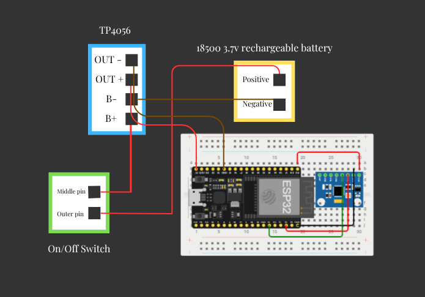
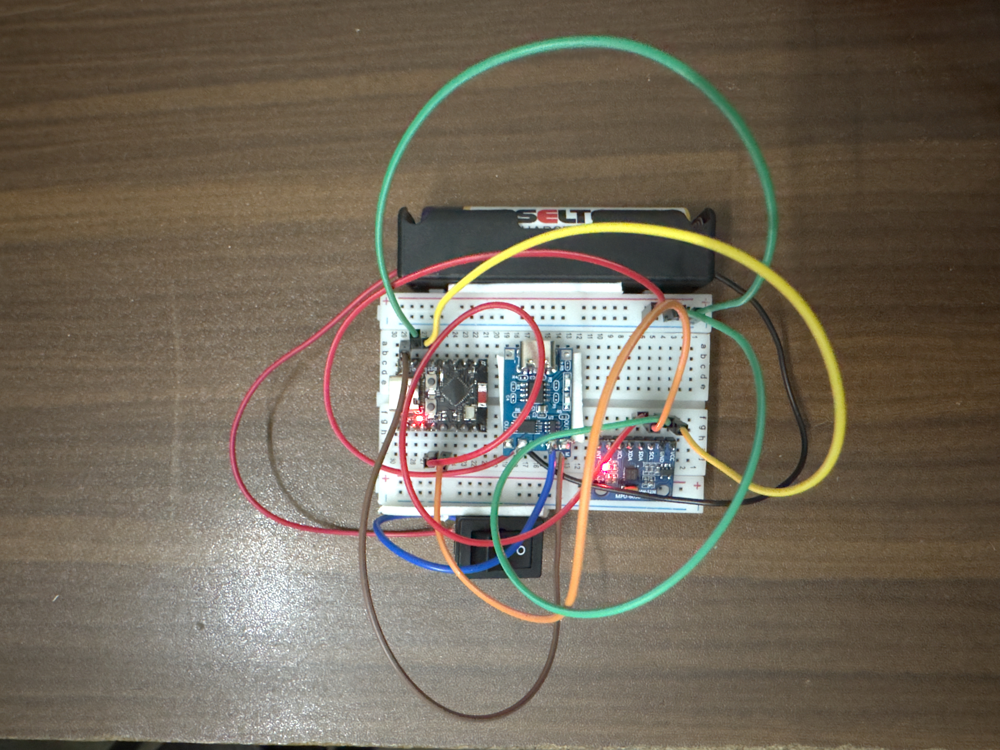

# 🦕 Chrome Dino Jump Controller

Play the Chrome Dinosaur game by physically jumping while wearing a hat.

Clip your ESP32 and MPU6050 to the brim of a cap, open `chrome://dino` in your browser, pair over Bluetooth, and jump — the accelerometer detects the motion and sends a spacebar keypress wirelessly to your PC in real time, making the dinosaur jump on screen.

No button. No keyboard. No controller. Just a hat, a jump, and a dinosaur avoiding cacti.

Built with an ESP32 / ESP32-C3 and an MPU6050 accelerometer, designed to be mounted on a hat for hands-free wearable play.

---

## 🧠 How It Works

1. The MPU6050 is mounted on the hat brim and measures acceleration on the Z axis 10 times per second
2. When you jump, your body (and hat) briefly exerts more than 1.5g of upward force
3. The ESP32 detects this spike and sends an 8-byte HID keyboard report over BLE
4. Windows receives it identically to a real keyboard pressing spacebar
5. The Chrome Dino jumps on screen in sync with you
6. The cooldown timer prevents one jump from firing multiple times

---

## 🎬 Demo


---

## ⭐ Recommended: ESP32 (Regular)

> If you are buying parts specifically for this project, get a **regular ESP32** (not C3). It is significantly easier to set up, uses a simpler library, and has better community support. The ESP32-C3 version is documented below for those who already have one.

---

## 📦 Parts List

| Part | Notes |
|------|-------|
| ESP32 Dev Board | Any standard ESP32 with 30 or 38 pins |
| MPU6050 | GY-521 breakout board recommended |
| Jumper wires | 4 wires needed |
| USB cable | Must be data cable, not charge-only |
| PC with Bluetooth | Built-in or USB Bluetooth adapter |
| Cap / Hat | Baseball cap works best — firm brim to mount components on |
| Small velcro strips or zip ties | To secure ESP32 and MPU6050 to the hat brim |
| 3.7V 18500 LiPo battery + holder | For wireless use — holder has red and black wires ready to connect |
| TP4056 charging module (6-pin) | Must be the 6-pin version with OUT+ and OUT- (has DW01 protection chip) |
| Rocker switch | SPDT 3-pin, for turning the device on and off |

> 💡 **Mounting tip:** Attach the MPU6050 flat against the top of the hat brim pointing upward so the Z axis faces the sky. This gives the cleanest jump detection. Secure the ESP32 to the side of the brim or tuck it into the hat band.

---

## 🔌 Wiring (ESP32)

### MPU6050 to ESP32

| MPU6050 Pin | ESP32 Pin |
|-------------|-----------|
| VCC | 3.3V |
| GND | GND |
| SDA | GPIO 21 |
| SCL | GPIO 22 |
| AD0 | GND |
| INT | Not connected |

> ⚠️ Always use **3.3V** not 5V. The ESP32 is not 5V tolerant and 5V will damage the MPU6050.

### Battery Circuit

| From | To |
|------|----|
| 18500 Holder RED wire | Switch outer pin |
| Switch middle pin | TP4056 B+ |
| 18500 Holder BLACK wire | TP4056 B- |
| TP4056 OUT+ | ESP32 VIN |
| TP4056 OUT- | ESP32 GND |

> ⚠️ Always connect to **VIN or 5V pin** on the ESP32, never the 3.3V pin directly — that bypasses the regulator and can damage the board.



### Full Power Chain

```
18500 (+)          18500 (-)
    ↓                  ↓
  Switch           TP4056 B-
    ↓                  ↓
TP4056 B+        TP4056 OUT-
    ↓                  ↓
TP4056 OUT+      ESP32 GND ──────────────────┐
    ↓                                        ↓
ESP32 VIN                              MPU6050 GND
    ↓
3.3V regulator
    ↓
MPU6050 VCC
```

> 💡 **Switch wiring:** The rocker switch has 3 pins and 2 holes per pin. Use the **horizontal hole** on each pin — thread your wire through and solder it. The vertical holes are for PCB mounting only. Use the outer pin and middle pin only, leave the third pin empty.

> 💡 **Charging:** Plug USB into the TP4056 to charge the battery. Red LED = charging, Blue/Green LED = fully charged. You can charge with the switch in either position.

> ⚠️ Always connect to **VIN or 5V pin** on the ESP32, never the 3.3V pin directly — that bypasses the regulator and can damage the board.

---

## 💻 ESP32 Installation (Recommended)

### Step 1 — Install Arduino IDE
Download and install Arduino IDE from https://www.arduino.cc/en/software

### Step 2 — Install ESP32 Board Package
1. Open Arduino IDE
2. Go to **File → Preferences**
3. In **Additional Boards Manager URLs** paste:
```
https://raw.githubusercontent.com/espressif/arduino-esp32/gh-pages/package_esp32_index.json
```
4. Click OK
5. Go to **Tools → Board → Boards Manager**
6. Search **esp32**
7. Find **esp32 by Espressif Systems**
8. Select version **2.0.17** from the dropdown
9. Click **Install** and wait

> ⚠️ Version matters. Use **2.0.17** specifically. Version 3.x breaks the BLE Keyboard library.

### Step 3 — Install Libraries
Go to **Sketch → Include Library → Manage Libraries** and install these one by one:

| Library | Author | Search term |
|---------|--------|-------------|
| ESP32 BLE Keyboard | T-vK | `ESP32 BLE Keyboard` |
| MPU6050 | Electronic Cats | `MPU6050` |

> For ESP32 BLE Keyboard — if it does not appear in Library Manager, install manually:
> 1. Go to https://github.com/T-vK/ESP32-BLE-Keyboard
> 2. Click **Code → Download ZIP**
> 3. In Arduino IDE: **Sketch → Include Library → Add .ZIP Library**

> 💡 `Wire.h` is a built-in Arduino library and comes pre-installed — you do not need to download it.

### Step 4 — Configure Board Settings
Go to **Tools** and set:

| Setting | Value |
|---------|-------|
| Board | ESP32 Dev Module |
| Port | Your COM port (appears when ESP32 is plugged in) |
| Upload Speed | 115200 |

### Step 5 — Upload the Code
1. Download `Jump_controller_esp32.ino` from this repo
2. Open it in Arduino IDE
3. Click **Upload**
4. Open **Serial Monitor** at **115200 baud**
5. You should see:
```
MPU6050 ready.
BLE advertising started.
Waiting for BLE...
```

### Step 6 — Pair with Windows
1. Windows **Settings → Bluetooth & devices → Add device**
2. Click **Bluetooth**
3. Select **Jump Controller**
4. Serial Monitor should print `Connected!`

### Step 7 — Test It
Open `chrome://dino` in Chrome and jump — the dinosaur should jump with you. Adjust `jumpThreshold` in the code if it is too sensitive or not sensitive enough:

```cpp
float jumpThreshold = 1.5; // increase to require bigger jump
                            // decrease if jumps aren't registering
```

---

---

## ⚙️ ESP32-C3 Installation

> Use this section only if you already have an ESP32-C3. If you are buying parts, use the ESP32 version above — it is much simpler.

### Additional Parts Notes
Everything is the same as the ESP32 version. The only wiring difference is that SDA moves from GPIO 21 to **GPIO 8** and SCL moves from GPIO 22 to **GPIO 9**. All other connections — VCC, GND, AD0, and the entire battery circuit — remain identical to the ESP32 diagram above.

### 🔌 Wiring (ESP32-C3)

| MPU6050 Pin | ESP32-C3 Pin |
|-------------|--------------|
| VCC | 3.3V |
| GND | GND |
| SDA | **GPIO 8** ← only change from ESP32 |
| SCL | **GPIO 9** ← only change from ESP32 |
| AD0 | GND |
| INT | Not connected |

> The battery circuit (TP4056, switch, 18500 holder) is wired exactly the same as the ESP32 version above.

### Step 1 — Install Arduino IDE
Download and install Arduino IDE from https://www.arduino.cc/en/software

### Step 2 — Install ESP32 Board Package
1. Open Arduino IDE
2. Go to **File → Preferences**
3. In **Additional Boards Manager URLs** paste:
```
https://raw.githubusercontent.com/espressif/arduino-esp32/gh-pages/package_esp32_index.json
```
4. Click OK
5. Go to **Tools → Board → Boards Manager**
6. Search **esp32**
7. Find **esp32 by Espressif Systems**
8. Install the latest version (3.x is fine for C3)

### Step 3 — Install Libraries
Go to **Sketch → Include Library → Manage Libraries** and install:

| Library | Author | Search term |
|---------|--------|-------------|
| NimBLE-Arduino | h2zero | `NimBLE-Arduino` |
| MPU6050 | Electronic Cats | `MPU6050` |

> The ESP32-C3 uses NimBLE instead of the standard BLE Keyboard library. Do not install ESP32 BLE Keyboard for this version.

> 💡 `Wire.h` is a built-in Arduino library and comes pre-installed — you do not need to download it.

### Step 4 — Configure Board Settings
Go to **Tools** and set:

| Setting | Value |
|---------|-------|
| Board | ESP32C3 Dev Module |
| Port | Your COM port |
| USB CDC On Boot | **Enabled** ← critical, Serial will not work without this |
| Upload Speed | 115200 |

> ⚠️ **USB CDC On Boot must be Enabled.** This is the most commonly missed step on ESP32-C3.

### Step 5 — Upload the Code
1. Download `Jump_controller_esp32_c3.ino` from this repo
2. Open it in Arduino IDE
3. Click **Upload**
4. If upload fails, hold the **BOOT** button on the board while clicking Upload, release when you see `Connecting...`
5. Open **Serial Monitor** at **115200 baud**
6. Press the **RST** button on the board
7. You should see:
```
MPU6050 ready.
BLE advertising started!
Waiting for connection...
```

### Step 6 — Pair with Windows
1. If you have paired before, go to **Settings → Bluetooth → Jump Controller → Remove device** first
2. Windows **Settings → Bluetooth & devices → Add device**
3. Click **Bluetooth**
4. Select **Jump Controller**
5. Windows will complete a secure pairing — Serial Monitor should print:
```
BLE Connected!
Encrypted connection established!
```

### Step 7 — Test It
Open `chrome://dino` in Chrome and jump. Adjust sensitivity in the code:

```cpp
float jumpThreshold = 1.5; // increase to require bigger jump
                            // decrease if jumps aren't registering
```

---



## 🔧 Troubleshooting

| Problem | Solution |
|---------|----------|
| Serial Monitor shows nothing | Enable USB CDC On Boot (C3) or check baud is 115200 |
| Jump Controller not appearing in Bluetooth | Check Serial Monitor is printing, restart ESP32 |
| Connects then immediately disconnects | Remove device from Windows and re-pair from scratch |
| MPU6050 not found | Check wiring, ensure VCC is 3.3V not 5V, power cycle board |
| Upload fails | Hold BOOT button while uploading, close Serial Monitor first |
| Jumps not registering | Lower `jumpThreshold` value (try 1.2) |
| Too many false triggers | Raise `jumpThreshold` value (try 2.0) |
| Disconnects after a few minutes | Device Manager → HID Keyboard Device → Power Management → uncheck allow PC to turn off |
| No power from battery | Check switch wiring, confirm TP4056 has 6 pins with OUT+ and OUT- |

---

## ⚙️ Configuration

Both versions share these settings at the top of the sketch:

```cpp
float jumpThreshold = 1.5;        // g-force required to trigger (1.0 = gravity)
unsigned long jumpCooldown = 500; // ms between jumps (prevents double triggers)
```

---

## 📡 How BLE HID Works

When a keyboard sends a keypress to a computer it sends a fixed 8-byte block called a **HID report**. Every keyboard in the world uses this same format defined by the USB HID specification. Your ESP32 sends this exact format over BLE.

### The 8-Byte Report

```
Byte 0  │  Byte 1  │  Byte 2  │  Byte 3  │  Byte 4  │  Byte 5  │  Byte 6  │  Byte 7
─────────────────────────────────────────────────────────────────────────────────────
Modifier │ Reserved │  Key 1   │  Key 2   │  Key 3   │  Key 4   │  Key 5   │  Key 6
```

- **Byte 0** — modifier keys (Ctrl, Shift, Alt etc.) as individual bits. `0x00` for plain spacebar
- **Byte 1** — always `0x00`, reserved by the HID spec and never used
- **Bytes 2–7** — up to 6 simultaneous keycodes. `0x2C` is the spacebar keycode

Pressing spacebar sends:
```
{ 0x00, 0x00, 0x2C, 0x00, 0x00, 0x00, 0x00, 0x00 }
```
Releasing sends:
```
{ 0x00, 0x00, 0x00, 0x00, 0x00, 0x00, 0x00, 0x00 }
```

Both reports are required — without the release report Windows thinks the key is held forever.

### The Report Descriptor

Before any keypresses are sent the device tells Windows what format to expect. This is the report descriptor — a schema that defines the 8-byte structure. Windows uses it to install the device as a standard keyboard with no custom drivers needed.

### Common Keycodes

| Key | HID Keycode |
|-----|-------------|
| Space | 0x2C |
| Enter | 0x28 |
| Arrow Up | 0x52 |
| Arrow Down | 0x51 |
| Arrow Left | 0x50 |
| Arrow Right | 0x4F |
| W | 0x1A |
| A | 0x04 |
| S | 0x16 |
| D | 0x07 |
| Escape | 0x29 |

Swap `0x2C` in the press array for any of these to send a different key instead of spacebar.

---

## 📁 Repo Structure

```
JumpController/
├── images/
│   ├── demo.gif                ← gameplay demo
│   ├── wiring_esp32.png        ← circuit diagram
│   └── breadboard.jpg          ← completed breadboard photo
├── Jump_controller_esp32.ino       ← use this for regular ESP32
├── Jump_controller_esp32_c3.ino    ← use this for ESP32-C3
└── README.md
```

> 📌 **Which file should I use?**
> - Regular ESP32 → `Jump_controller_esp32.ino`
> - ESP32-C3 → `Jump_controller_esp32_c3.ino`
>
> Do not mix them up — the libraries and pin numbers are different between the two versions.

---

## 📄 License

Do whatever you want with this. Put it on a hat. Jump around.
